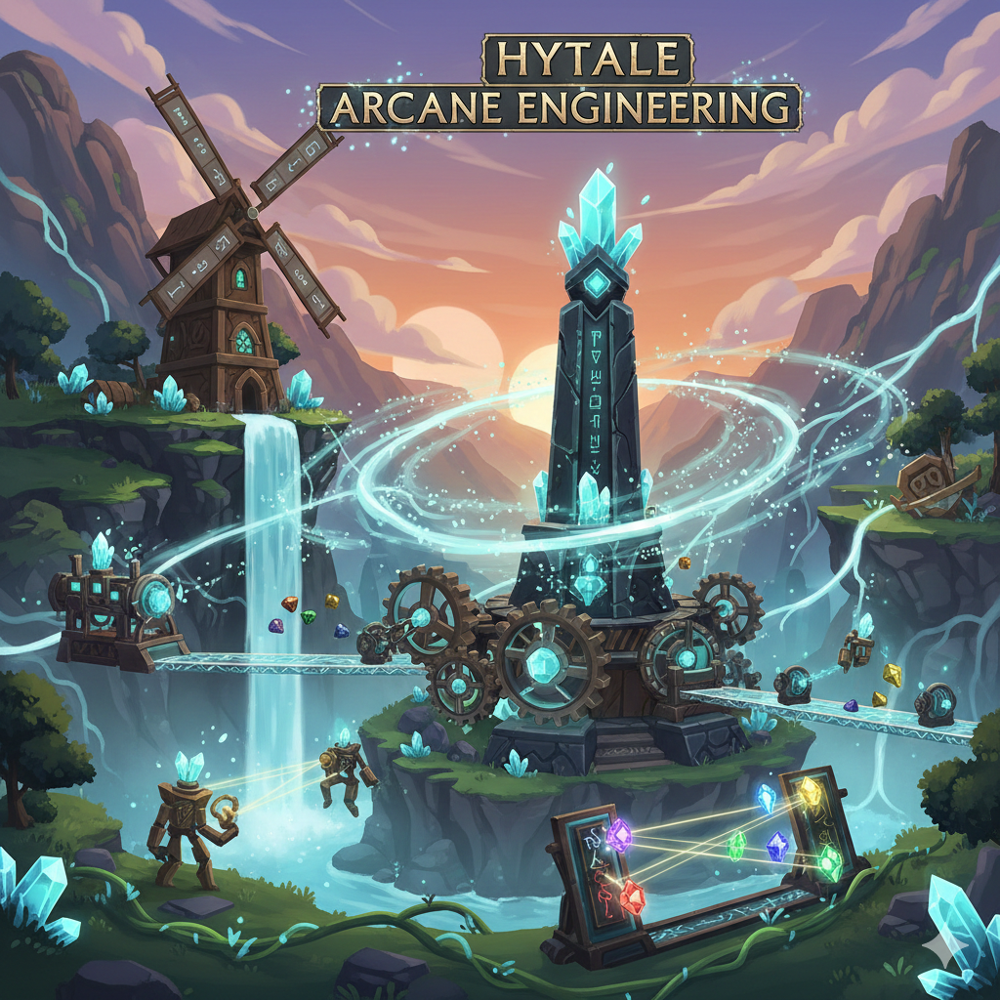

# Hytale Arkane Engineering



**Arcane Flow System** - A magic energy network mod for Hytale

## Overview

Arkane Engineering introduces a sophisticated arcane energy system that allows players to generate, transfer, and control magical flow through interconnected blocks. Build complex magical networks with generators, channels, and control mechanisms.

## Core Features

- **Crystal Pillars**: Generate arcane flow passively (5 flow/tick)
- **Arcane Channels**: Transfer flow up to 32 blocks with 1 flow decay per block
- **Arcane Levers**: Control flow with persistent ON/OFF switches (1 passive flow when active)
- **Arcane Buttons**: Temporary flow control for 10 ticks (1 passive flow when pressed)

## Technical Details

- **Flow Propagation**: Balanced transfer system with decay mechanics
- **Capacity System**: Each component has configurable storage capacity
- **Tick-based Updates**: Smooth flow distribution across the network

## Development Status

⚠️ **Currently in Development**

This mod is a foundational framework built in anticipation of Hytale's official release and API documentation. All implementations are based on predicted API structures and will be updated once official modding support is available.

## Project Structure

```
src/
├── IArcaneFlow.java              # Core flow interface
├── ArcaneFlowBaseTileEntity.java # Base implementation
├── ArcaneChannelTileEntity.java  # Flow transfer logic
├── CrystalPillarTileEntity.java  # Flow generator
├── ArcaneLeverTileEntity.java    # Persistent switch
└── ArcaneButtonTileEntity.java   # Temporary switch
```

## License

[MIT License - Non-Commercial Use Only](LICENSE.md)

This project is licensed under a modified MIT License that restricts commercial use. See the [LICENSE.md](LICENSE.md) file for full details.

---

*Built with anticipation for Hytale by the community*
